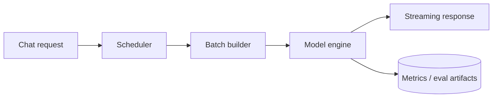

# nanoserve

nanoserve is a local LLM serving engine for Apple Silicon.

## What it does

- Serves an OpenAI-compatible chat API
- Supports continuous batching with FCFS and synchronized admission
- Reuses KV cache prefixes when prompts overlap
- Includes fp16, INT8, INT4, and MLX paths
- Exposes Prometheus metrics and a Grafana dashboard
- Ships benchmark and evaluation harnesses

## Architecture



## What’s included

- API server
- Scheduler and engine
- Prefix cache
- Quantization paths
- Metrics and ops dashboards
- Benchmark and eval scripts

## Quick start

```bash
make dev-install
make models
make baseline-hf
make parity
make serve
make observe
make eval
```

## Notes

- The project is built around local MPS inference on Mac hardware.
- Continuous batching helps when the workload and admission policy line up.
- Quantization is useful when the runtime has native support for it; on MPS that depends on the path.

## Portfolio Proof

- Architecture and evaluation: [docs/PORTFOLIO_PROOF.md](docs/PORTFOLIO_PROOF.md)
- Verified metrics: [results/ablations.csv](results/ablations.csv) and [results/eval.csv](results/eval.csv)
- Benchmark matrix: [docs/BENCHMARK_MATRIX.md](docs/BENCHMARK_MATRIX.md)
- Demo and local mode: use the `make` commands above
- Test commands: `pytest`, `python -m compileall src`
